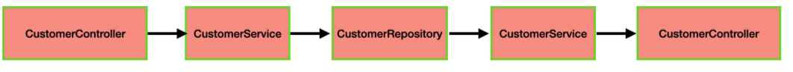
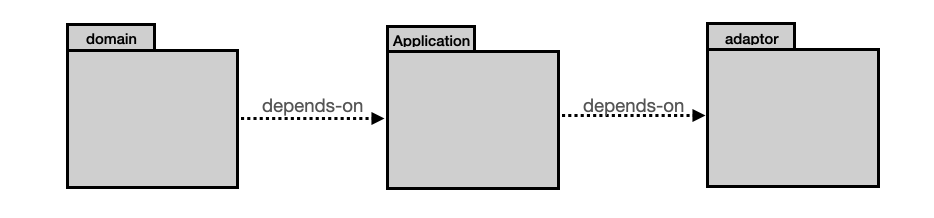
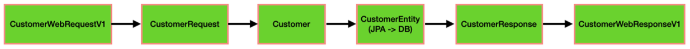
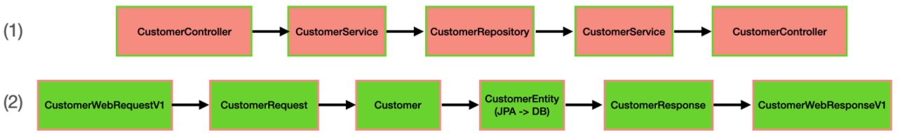

## 문제상황 제시
보통 애플리케이에 API 요청이 들어오면 프로세스는 다음과 같을 것이다.

>애플리케이션이 **API 요청을 받고** ➩ **Controller** ➩ **Service** ➩ **Repository** ➩ **Service** ➩ **Controller로** 나가는 구조이다.

즉 그림으로 보면 이런 구조가 되겠다.

※ Customer 도메인으로만 예시를 들겠음


이런 구조가 확장성이 있는 구조인지 다시 생각해 보았고 더 확장성과 유연함을 가지는 구조를 취해보려한다.

## 해결방안 모색
API Request를 받고 Response를 내보내기 까지 위의 구조 보다 더 세부적으로 나누면 조금 더 확장성과 유연함을 가지는 구조가 될 것 같다.

즉,

>**WebRequestV1** ➩ **DomainRequest** ➩ **Domain** ➩ **DomainEntity** ➩ **DomainResponse** ➩ **WebResponseV1**

<br>

### WebRequestV1, WebResponseV1

고객이 API를 통해 서버로 데이터를 보내면 서버가 데이터를 받고 그 데이터를 어떻게 안에서 대처하든 고객은 상관쓰지 않기 때문에 서버 개발자 마음대로 내부 로직을 처리한다.
내부 로직이 바뀌어서 사이드 이팩트로 API 호출 파라메터를 바꿀 필요가 없다. 그래서 이 두개의 dto는 불변이어야 한다. 그래야만 고객과의 신뢰를 쌓을 수 있다.
이렇게 되면 프론트앤드와의 협업에도 좋아진다. Controller의 파라메터의 수정에 의해 갑자기 파라메터가 바뀔 일이 없어지기 때문에 한번 정해놓은 약속을 어길 일이 없어지기 때문이다.

<br>

### DomainRequest, DomainResponse
이 단계에서는 **유동성**과 **통일성**을 갖는다.

- **유동성:** WebRequest에서 들어오는 데이터를 내부 로직에 맞게 데이터를 변경해서 Domain에 넘겨줄 수 있기 때문에 내부 도메인에 더 집중할 수 있다.


- **통일성:** 만약 WebRequestV1 ➩ DomainRequest 구조가 아니고 이 구조를 WebRequestV{versionNumber} 하나로 묶는다면

  >register(CustomerWebRequestV2 customer)

  >register(CustomerWebRequestV3 customer)

  이런식으로 병렬적으로 늘어나는 단점이 있지만, WebRequestV1 ➩ DomainRequest 이런 구조가 되면

  >register(CustomerRequest customer)

  >register(CustomerRequest customer)

  Service로 들어올 수 있는 데이터가 통일될 수 있고 로직도 통일될 수 있는 장점을 갖는 구조가 된다.

<br>

### Domain, DomainEntity

JPA를 사용하면 테이블과 그 테이블에 해당하는 객체를 매핑을 한다. 그 매핑하는 역할은 DomainEntity이고, Domain은 DB와 상관 없는 POJO이다.

```
adaptor
├── inbound (primary adapter)
│   ├── api
│   ├── CustomerController
│   ├── CustomerWebRequestV1
│   ├── CustomerWebResponseV1
├── outbound (secondary adapter)
│   ├── jpa
│   ├── BaseEntity (package-private)
│   ├── CustomerEntity (package-private)
│   ├── CustomerJpaReposity (implements JpaRepository<>) (package-private)
│   └── CustomerRepositoryAdapter (implements CustomerRepository) (package-private) @Bean
│
application
├── CustomerService
├── CustomerRequest
└── CustomerResponse
│
domain
├── Customer
└── CustomerRepository
```
이와 같은 구조가 되고 코드로 보면,

```java

class CustomerService {
    @Autowire
    private CustomerRepository repository; // DI (CustomerRepositoryAdapter)
	public CustomerResponse save(CustomerRequest request) {
	   repository.save(request.toCustomer());
	}
}


// 저장소가 뭐가 될진몰라 근데 도메인을 저장해..
interface CustomerRepository {
	public Customer save(Customer customer);
}
```

```java

import CustomerEntity;

class CustomerRepositoryAdapter implements CustomerRepository {

  private CustomerJpaReposity jpaRepository;

	@override
	public Customer save(Customer customer) {
       CustomerEntity entity = customer.toCustomerEntity();
       CustomerEntity entity = jpaRepository.save(entity);
	   return entity.toCustomer();
	}
}
```
CustomerService는 무엇으로 어디에 저장할지는 몰라도 그냥 일단 “저장”을 한다.
그리고 CustomerRepository가 PORT 역할을 하고 JPA, MyBatis, Redis 등등의 어뎁터들이 포트에 끼워지며 저장 OCP에 위반되지 않는 코드가 된다.

CustomerRepositoryAdapter에서 로직을 살펴보면 CustomerRepositoryAdapter 와 통신하는 주체 자체는 Customer 클래스이다.
이렇게 되면 CustomerEntity 객체가 CustomerJpaReposity와 CustomerRepositoryAdapter 안에서만 사용하기 때문에 밖에 나가지 않아서 구분이 확실해진다. 즉 각 역할별로 모듈화가 잘된다. 모듈화가 잘 되면 Service에서는 Service에만 집중할 수 있게 되어 논리적인 코드를 짤 수 있게 된다. 역할의 분리가 잘 된다.
이 구조는 의존성 방향에 장점이 있다.


즉, **application은 adaptor의 상세 구현을 모르는 구조가 된다.**

<br>

## 찾은 해결방안 적용


이런 구조가 되어야 한다.

## 결과

2번 구조가 되면서 각 계층의 의존성이 분리가 되어 확장성 있고 유연한 구조가 되었다.