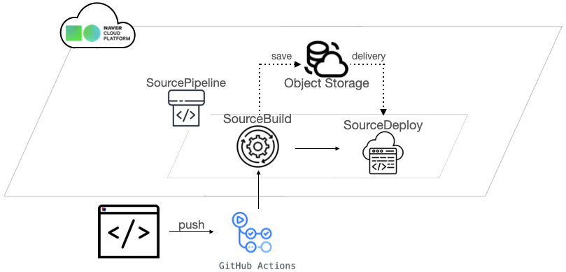

## CI/CD란
**CI**는 **지속적인 통합(Continuous Integration)** 을 의미한다. CI는 새로운 코드 변경 사항이 생기면 빌드 및 테스트되어 공유 레포지토리에 통합되는 프로세스를 한다.

**CD**는 **지속적인 배포(Continuous Deployment)** 을 의미한다. CD는 CI에서 빌드 및 테스트 통과 후 업데이트 되었고 통합된 코드를 자동으로 배포하는 프로세스를 한다. 

## 문제상황 제시
CI/CD 파이프라인은 꼭 필요했다. 왜냐하면 일일히 빌드 및 테스트를 하고, 테스트가 정상 통과된 업데이트된 코드를 배포를 수기로 하면 쉽지만 정말 힘든 작업이다.
비즈니스 로직 개발에 더 집중하기 위해 CI/CD는 꼭 필요한 기능이었다.

## 해결방안 모색
CI/CD의 장점은 다음과 같다.

1. **빠른 피드백:** 공유 레포지토리에 빌드 및 테스트가 통과된 코드가 올라가기 때문에 코드 변경에 대한 다른 개발자들의 빠른 피드백을 받을 수 있기 때문에, 문제를 해결하는데 드는 시간과 노력을 줄일 수 있다.
2. **향상된 코드 품질:** 코드 변경 사항이 코드베이스에 통합되기 전에 철저하게 테스트되도록 보장한다. 이를 통해 버그 및 기타 문제를 초기에 파악하여 소프트웨어의 전반적인 품질을 향상시킬 수 있다.
3. **리스크 감소:** 테스트 및 배포 프로세스를 수기로 하면서 일어날 수 있는 인적 오류가 감소한다.
4. **협업 개선:** 프로젝트 참여자들에게 변경 사항과 개발 프로세스 등을 공유하여 협업을 촉진시키고, 의사 소통을 개선하여 원활한 협업이 가능하다.
5. **생산성 증가:** CI/CD를 사용하면 테스트 및 배포와 같은 반복적인 작업에 소요되는 시간과 노력을 줄일 수 있어서 비즈니스 로직 개발에만 집중할 수 있게 해주면서 생산성이 증가한다.

이와 같은 이유로 CI/CD를 적용하기로 결정하였고, 이를 제공하는 여러가지 옵션을 생각해 보았다.

- Naver Cloud Platform(SourceCommit, SourceBuild, SourceDeploy, SourcePipeline)
- Github Actions
- Jenkins

Jenkins를 사용해도 되었지만 Naver Cloud Platform에서 제공하는 기능과 Github Actions에서 제공하는 기능으로 충분하고 어차피 비슷한 기능이라고 생각하여, 이를 조합해서 CI/CD 환경을 구축해보았다.

## 찾은 해결방안 적용
IDE에서 코드를 작성하고 깃헙 레포지토리로 push를 하면 Github Actions가 자동 빌드 및 테스트 후,
NCP의 SourceBuild에 연동 된 나의 Github 레포지토리의 코드를 SourceDeploy로 전달하는 방식으로 환경을 구축한다.

>IDE(code push) ➩ Github Actions(build & test) ➩ SourceBuild ➩ SourceDeploy ➩ 배포 완료

## 결과

