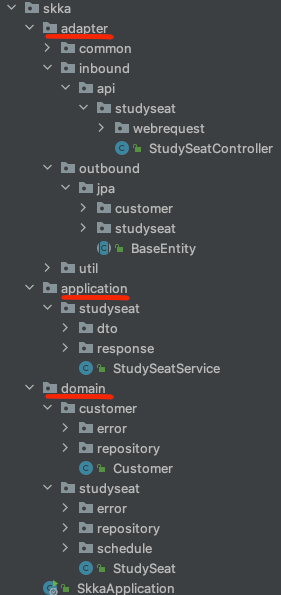
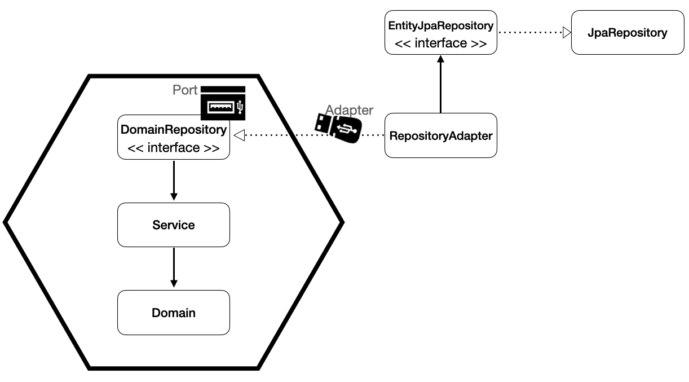

## 문제상황 제시
확장성/유연함
> *프로그램이 복잡해짐에도 불구하고 새로운 기능을 계속 추가하고 기존 기능을 수정하는 것이 어려워지지 않는 구조,*

 

테스트 용이성
> *계층 간 의존성으로 인해 테스트 코드를 분리하기 어렵지 않은 구조,*

 

유지보수성
> *하나의 클래스에서 변경이 있어도 다른 클래스에서 영향이 적은 구조,*

 

도메인 집중성
> *비즈니스 로직을 시스템의 중심에 두어 도메인과 비즈니스 요구사항을 효과적으로 충족시킬 수 있는 구조,*

 

미래 지향적/이식성
> *기술 변경에 대해 쉽고 빨리 대처할 수 있는 구조*

  

<u>**확장성/유연함**</u>, <u>**테스트 용이성**</u>, <u>**유지보수성**</u>, <u>**도메인 집중성**</u>, <u>**미래 지향적/이식성**</u> 을 가진 구조를 지향하기 위한 아키텍처를 선택 해야 하는 상황이다.

 

## 해결방안 모색
이를 해결 하기 위해 `Hexagonal architecture` 를 채택 하였다.

`Hexagonal architecture` 는 다음과 같은 장점을 갖는다.
- <u>**유연성**</u>: 더 유연하고 변화에 적응할 수 있도록 설계가 가능하다.
- <u>**테스트 용이성**</u>: 각 계층의 역할이 분리되어 있어 비즈니스 로직이 인프라와 분리되어 테스트 작업이 가능하다.
- <u>**유지 보수성**</u>: 각 계층이 명확하게 분리되어 있어 코드 수정시 의도하지 않은 부작용이 발생할 가능성이 적어져 시스템을 더 쉽게 유지 보수가 가능하다.
- <u>**도메인 집중성**</u>: 비즈니스 로직을 시스템의 중심에 두어 도메인 및 비즈니스 요구사항을 효과적으로 충족이 가능하다.
- <u>**미래 지향적**</u>: 핵심 비즈니스 로직과 인프라를 명확하게 분리하여 기술 변경에 대한 대처를 쉽게 가능하다.

 

그리고 `Hexagonal architecture`는 세 가지의 층으로 구분된다. **domain**, **application**, **adapter**

이렇게 구분 하면서 각각의 레이어가 **독립적**인 구조가 된다. 이로 인해 하나의 레이어에서 변경이 있어도 다른 레이어에는 영향이 없는 구조가 된다. 
그러므로 변경과 유지보수가 쉬워져 변경과 <u>**확장에 유연한 구조**</u>가 된다.

 

## 찾은 해결방안 적용
비즈니스 로직은 application과 domain 에서 구현한다. 세부적으로는 도메인 모델과 도메인 엔티티는 domain 레이어에 위치하고, 서비스 로직은 application 레이어에 위치한다.
그리고 adapter에는 비즈니스 로직과 상관 없는 외부 시스템들을 위치시킨다. 그리고 외부와 내부의 통신은 입력 포트와 출력 포트로 이루어지는 구조가 된다.
외부 시스템과의 소통은 인터페이스를 통해 소통을 한다. 그러므로 핵심 로직은 포트의 구체 클래스에 의존하는 것이 아닌 인터페이스에만 의존하여 의존성 주입(DI)으로 도메인 로직에 연결해야한다.

## 결과

핵심 도메인 로직과 입력/출력 메커니즘을 분리하고 인터페이스를 사용하여 그 사이의 계약을 정의한다. 이렇게 하면서 <u>**확장성/유연함**</u>, <u>**테스트 용이성**</u>, <u>**유지보수성**</u>, <u>**도메인 집중성**</u>, <u>**미래 지향적/이식성**</u>인 구조를 가질 수 있게 된다.

그래서 다음과 같은 구조가 되었다.

